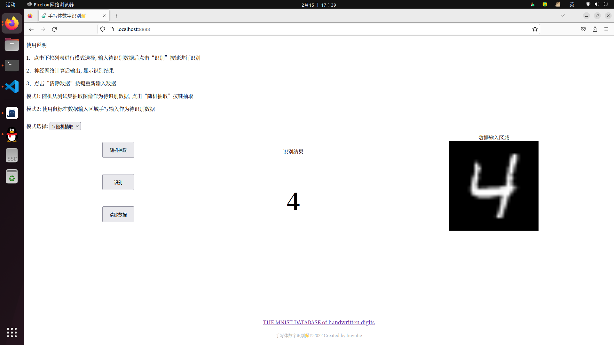

# Pytorch+Bottle实现手写体数字识别

## Overview


## How to run
Create a Python virtual environment (Optional)
```bash
python3 -m venv venv
source ./venv/bin/activate
```
Install the required packages
```bash
pip install -r requirements.txt
```
Train model
```bash
python ./train.py
```
Run the main code
```bash
python ./main.py
```

## Acknowledgement
[https://github.com/hamlinzheng/mnist](https://github.com/hamlinzheng/mnist)

[http://yann.lecun.com/exdb/mnist/](http://yann.lecun.com/exdb/mnist/)
